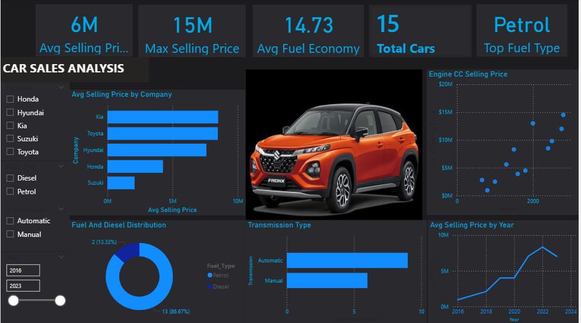

# Car Sales Analysis Dashboard

A Power BI dashboard analyzing car sales data across five companies (Honda, Hyundai, Kia, Suzuki, Toyota), covering pricing trends, fuel type distribution, transmission preferences, and selling price trends from 2016 to 2023.

## Dashboard Preview

## Key Metrics

- Average Selling Price: 6M
- Max Selling Price: 15M
- Average Fuel Economy: 14.73
- Total Cars: 15
- Top Fuel Type: Petrol

## What the Dashboard Covers

- Average Selling Price by Company. price comparison across Kia, Toyota, Hyundai, Honda, and Suzuki
- Engine CC vs Selling Price , scatter plot showing the relationship between engine capacity and price
- Fuel and Diesel Distribution, donut chart showing Petrol (86.67%) vs Diesel (13.33%) split
- Transmission Type — Automatic vs Manual distribution
- Average Selling Price by Year (2016–2023),  pricing trend over time, with a peak around 2022
- Interactive filters, slicers for company, fuel type, transmission type, and year range

## Tools Used

- Power BI (data modeling, DAX measures, visualization)
- DAX for average pricing and fuel economy measures

## Files

- car_sales_dashboard.pbix — Power BI dashboard file
- image.png — Preview image of the dashboard
- Source dataset (add file name once uploaded)

## Author

Justinah Ajayi — Data Analyst
